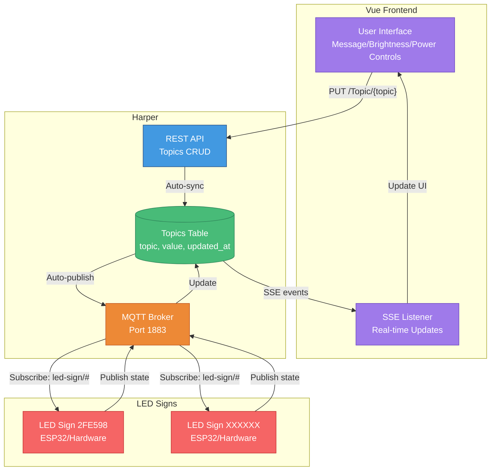

# LED Sign Control with Harper & Vue

Real-time LED sign control system built with [Harper](https://www.harperdb.io/) and Vue 3. Control multiple LED signs via MQTT with a responsive web interface featuring bidirectional real-time synchronization.

## Features

- Vue 3 web interface for LED sign control
- Real-time bidirectional sync between UI and hardware
- MQTT communication with Harper as broker
- State persistence in Harper database
- Server-Sent Events (SSE) for live updates
- Support for multiple LED signs
- Control message, brightness (0-15), and power state

## Architecture



### Data Flow

**Write Path (User → LED Sign):**
1. User changes value in Vue UI (optimistic update)
2. Vue sends REST PUT to Harper `/Topics/{topic-path}`
3. Harper persists to Topics table
4. Harper auto-publishes to MQTT topic
5. LED sign receives MQTT message and updates

**Read Path (LED Sign → User):**
1. LED sign publishes state to Harper MQTT broker
2. Harper updates Topics table automatically
3. Harper sends SSE event to connected clients
4. Vue receives update and syncs UI state

### Topic Structure

```
led-sign/<sign-id>/message     # Display text
led-sign/<sign-id>/brightness  # 0-15 integer
led-sign/<sign-id>/power       # "on" or "off"
```

Example: `led-sign/2FE598/message` with value `"Hello World"`

## Quick Start

### Prerequisites

- [Harper](https://docs.harperdb.io/docs/install-harperdb): `npm install -g harperdb`
- Node.js 16+ for Vue development

### Installation

1. Clone this repository
2. Install dependencies:
   ```bash
   npm install
   ```

3. Configure environment (`.env`):
   ```env
   VITE_HARPER_URL=http://localhost:9926
   VITE_SIGN_ID=2FE598
   ```

4. Start Harper:
   ```bash
   harperdb run .
   ```

5. In development, run Vue dev server:
   ```bash
   npm run dev
   ```

6. For production, build Vue app (outputs to `dist/`):
   ```bash
   npm run build
   ```
   Harper serves the built app automatically from `dist/`

### LED Sign Configuration

Configure your LED sign (ESP32 or similar) to connect to Harper's MQTT broker:
- **Broker:** `<your-harper-host>:1883`
- **Subscribe to:** `led-sign/<your-sign-id>/#`
- **Publish to:** `led-sign/<your-sign-id>/{message|brightness|power}`

## Project Structure

```
.
├── config.yaml           # Harper configuration (REST & static files)
├── schema.graphql        # Database schema (Topics table)
├── resources.js          # Custom resource logic (optional)
├── src/
│   ├── App.vue          # Main Vue component
│   ├── main.js          # Vue entry point
│   └── services/
│       └── harperApi.js # Harper REST/SSE client
├── docs/
│   └── plans/           # Design documents
└── dist/                # Built Vue app (served by Harper)
```

## Configuration Files

### [config.yaml](./config.yaml)
Harper configuration specifying REST API, static file serving, and schema location.

### [schema.graphql](./schema.graphql)
Database schema defining the Topics table for MQTT state persistence:
```graphql
type Topics @table @export (name: "") {
  topic: String @primaryKey
  value: String
  updated_at: DateTime
}
```

### [resources.js](./resources.js)
Optional JavaScript resource classes for custom endpoint logic.

## Development

### Running Tests
```bash
npm test
```

### MQTT Testing
Use `mqtt-test.js` to send test messages:
```bash
node mqtt-test.js
```

## Design Documentation

See [Design Document](./docs/plans/2026-01-06-led-sign-harper-integration-design.md) for detailed architecture, implementation details, and testing strategy.

## License

Apache 2.0